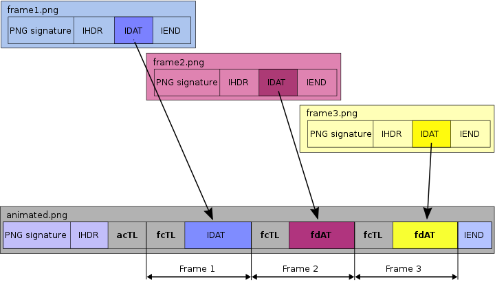

简体中文 | [English](./README.md)

# apng-handler
📝 直接运行在浏览器环境🌐 的处理(a)png的npm package，包含：

1. （decode）将apng解析出png序列帧
2. （encode）将png序列帧组装成apng 

## 简介
我们的生产环境已经使用了一个很棒的库——[apng-canvas](https://github.com/davidmz/apng-canvas)。它让你能很方便的操控apng的播放。但大部分时间我们都在写业务代码，很少接触到二进制的相关操作与JS的位运算，这个库又几乎没有注解，想要深入了解`(a)png`的开发者还需要查阅很多资料。我理解了这个库的核心代码，增加了很多注解。

并基于此编写了**浏览器环境下**由png序列生成apng的代码片段。


## Usage

> 当前这个包并没有提供足够多的能力。但是我还是发到了npm上去，方便开发者尝试使用。很快，我们的能力将会更丰富。

### 安装

-  使用 node_module

```bash
npm install apng-handler --save
```

- 使用 cdn 
```html
<script src="https://unpkg.com/apng-handler@{{version}}/dist/index.js"></script>
```

### demo

```typescript
// window.ApngHandler
import { apngDecoder, apngAssembler } from 'apng-handler';

const appendImg = (buf: ArrayBuffer) => {
  const img = document.createElement('img');
  img.width = 100;
  const url = URL.createObjectURL(
    new Blob([new Uint8Array(buf)], { type: 'image/apng' })
  );
  img.src = url;
  document.body.appendChild(img);
};

const blob = apngAssembler({
  buffers: [],// image buffers
  width: 302,
  height: 192,
});

blob.arrayBuffer().then((buf) => {
  appendImg(buf);
  apngDecoder(buf).then((blobs) => {
    blobs.forEach((b) => {
      b.arrayBuffer().then((_b) => {
        appendImg(_b);
      });
    });
  });
});
    
```



## 学习资料
1. [APNG 规范](https://wiki.mozilla.org/APNG_Specification#.60acTL.60:_The_Animation_Control_Chunk)

    最重要的资料，详细解释了每个apng相比于png增加的一些规范。

2. [W3C PNG 规范](https://www.w3.org/TR/PNG/)

    W3C的文档，想要深入了解必须阅读学习的。但是过于专业，我也没有都看完，主要还是看一些概念性的东西。我想如果以后需要去了解压缩的实现的话一定还要再看看的。

3. [APNG 维基百科](https://en.wikipedia.org/wiki/APNG)
   
   主要就是那张解释图，很多文章都会引用的，我加在README里了
  
4. [Web 端 APNG 播放实现原理](https://segmentfault.com/a/1190000023516861)

   国内网易云前端团队对于apng-canvas的解释，里面的一张图非常不错

5. [ezgif.com](https://ezgif.com/apng-maker/ezgif-6-bb2ad99e-apng)

    生成apng的在线工具

6. [APNG Assembler](http://apngasm.sourceforge.net/)

    生成、解析apng的一款软件
7. [Join up PNG images to an APNG animated image](https://stackoverflow.com/questions/18297616/join-up-png-images-to-an-apng-animated-image)

    回答了一个Node环境下的encode方法

8. [UPNG.js](https://github.com/photopea/UPNG.js)

   我试用了一次但是失败了，可能是用法有问题，另外这个代码也不是很好懂，没有细看了。

# 更多
💓 欢迎pr，提供更多apng的处理方法，比如压缩、裁剪、着色等等
