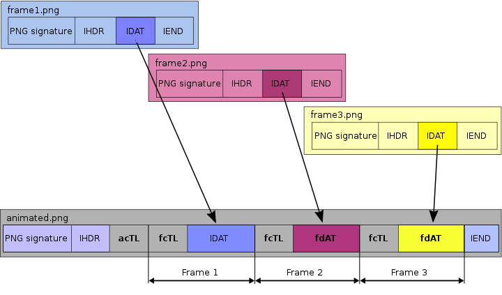

English | [简体中文](./README-zh_CN.md)

# apng-handler
📝 code snippets of decode and encode (a)png in modern browser environment 🌐. Including：

1. （decode）get png frames from apng buffer
2. （encode）assemble png buffers to apng buffer

## Intro
We have already used a great library -- [apng-canvas](https://github.com/davidmz/apng-canvas) in our production environment. It gives you ability to control apng playing behavior. Generally, I spend most of my time on normal logic codes. I hardly get the chance to know blob, buffer and bitwise operation while this lib has few annotation. We need more references to know more about`(a)png`. I learned this lib and add lots of annotation to it.

Additionally, I wrote a snippet of assemble apng buffer from png buffers, which runs in browser environment.

## More References
1. [APNG Specification](https://wiki.mozilla.org/APNG_Specification#.60acTL.60:_The_Animation_Control_Chunk)

    Most important ref, explained specification of apng compared to png.

2. [W3C PNG Spec](https://www.w3.org/TR/PNG/)

    W3C specification. Must learn to know deep about png structure. I just learned some conception stuff without reading through. When using compression techs, I suppose I have to go back to this ref. 

3. [APNG Wiki](https://en.wikipedia.org/wiki/APNG)
   
   that picture has been referred by many articles (I posted it in README)
  
4. [Web 端 APNG 播放实现原理](https://segmentfault.com/a/1190000023516861)

   including a great picture, mainly explaining apng-canvas lib

5. [ezgif.com](https://ezgif.com/apng-maker/ezgif-6-bb2ad99e-apng)

    online tool of processing apng and gif

6. [APNG Assembler](http://apngasm.sourceforge.net/)

    application of generating apng

7. [Join up PNG images to an APNG animated image](https://stackoverflow.com/questions/18297616/join-up-png-images-to-an-apng-animated-image)

    an answer about encoding approach in Node environment

8. [UPNG.js](https://github.com/photopea/UPNG.js)

   I used once but failed, perhaps I used it wrong. The code is also hard to understand. I didn't go deep.

# Tail

💓 Plz feel free to make pr to add more functions of handling apng like compressing, clipping and coloring, etc.
